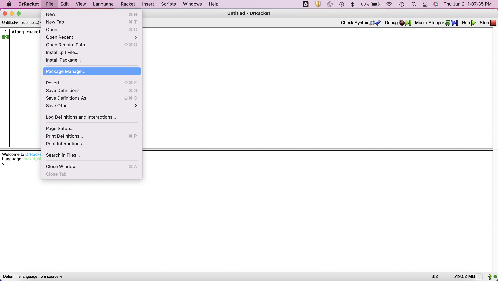
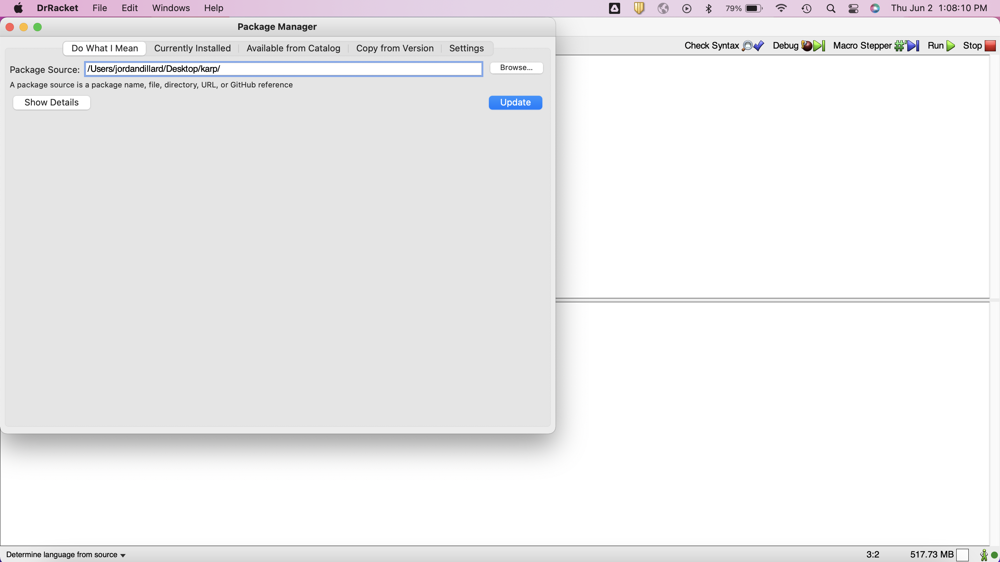

# PROJECT STATUS

Development of this version of the Karp web app will slow to a halt at the conclusion of Northwestern's 2022 Spring Quarter. It will likely be maintained and/or continued by the faculty of the COMP_SCI 336 course, though in the event that other contributors take on this project, this repository may be forked for further development.

# Karp

## Description

Karp is a web application written in JavaScript and React used to verify reductions of NP-Problems in real-time, allowing users to enter their problem definitions, forward and backward certificates, and instances in the titular Karp language. The app interprets the Karp text as Racket code, runs it on a backend server, generates the output, and feeds this back to a console on the frontend of the app.

The primary use-case for Karp is for Northwestern University students taking COMP_SCI 336: Design and Analysis of Algorithms, in which assignments are given involving the need to produce a reduction between two given problem definitions that is proven to be correct. 

## Background

### Class NP

*Insert description of NP problems here*

### Reductions

*Insert description of reductions here*

## Features

- Problem Definitions: 
- Reduction Verification:

## Installation

### Requirements

In order to properly run Karp in its current state, the latest version of [Racket](https://download.racket-lang.org/) (v8.4) and Karp (v2.0) must be installed. Karp is currently maintained as propriety software by faculty of the COMP_SCI 336 course, and as such, will only be distributed to current students of the course, and to authorized contributers of this repository on an individual basis.

After installing Racket and opening DrRacket, use the package manager to install the Karp package.

## Usage

*Insert screenshots of usage*

## Contributing
Pull requests are welcome. For major changes, please open an issue first to discuss what you would like to change.

Please make sure to update tests as appropriate.

## Authors and Acknowledgment

*Insert authors and acknowledgements*

## License

N/A

# Getting Started with Create React App

This project was bootstrapped with [Create React App](https://github.com/facebook/create-react-app).

## Available Scripts

In the project directory, you can run:

### `npm start`

Runs the app in the development mode.\
Open [http://localhost:3000](http://localhost:3000) to view it in your browser.

The page will reload when you make changes.\
You may also see any lint errors in the console.

### `npm test`

Launches the test runner in the interactive watch mode.\
See the section about [running tests](https://facebook.github.io/create-react-app/docs/running-tests) for more information.

### `npm run build`

Builds the app for production to the `build` folder.\
It correctly bundles React in production mode and optimizes the build for the best performance.

The build is minified and the filenames include the hashes.\
Your app is ready to be deployed!

See the section about [deployment](https://facebook.github.io/create-react-app/docs/deployment) for more information.

### `npm run eject`

**Note: this is a one-way operation. Once you `eject`, you can't go back!**

If you aren't satisfied with the build tool and configuration choices, you can `eject` at any time. This command will remove the single build dependency from your project.

Instead, it will copy all the configuration files and the transitive dependencies (webpack, Babel, ESLint, etc) right into your project so you have full control over them. All of the commands except `eject` will still work, but they will point to the copied scripts so you can tweak them. At this point you're on your own.

You don't have to ever use `eject`. The curated feature set is suitable for small and middle deployments, and you shouldn't feel obligated to use this feature. However we understand that this tool wouldn't be useful if you couldn't customize it when you are ready for it.

## Learn More

You can learn more in the [Create React App documentation](https://facebook.github.io/create-react-app/docs/getting-started).

To learn React, check out the [React documentation](https://reactjs.org/).

### Code Splitting

This section has moved here: [https://facebook.github.io/create-react-app/docs/code-splitting](https://facebook.github.io/create-react-app/docs/code-splitting)

### Analyzing the Bundle Size

This section has moved here: [https://facebook.github.io/create-react-app/docs/analyzing-the-bundle-size](https://facebook.github.io/create-react-app/docs/analyzing-the-bundle-size)

### Making a Progressive Web App

This section has moved here: [https://facebook.github.io/create-react-app/docs/making-a-progressive-web-app](https://facebook.github.io/create-react-app/docs/making-a-progressive-web-app)

### Advanced Configuration

This section has moved here: [https://facebook.github.io/create-react-app/docs/advanced-configuration](https://facebook.github.io/create-react-app/docs/advanced-configuration)

### Deployment

This section has moved here: [https://facebook.github.io/create-react-app/docs/deployment](https://facebook.github.io/create-react-app/docs/deployment)

### `npm run build` fails to minify

This section has moved here: [https://facebook.github.io/create-react-app/docs/troubleshooting#npm-run-build-fails-to-minify](https://facebook.github.io/create-react-app/docs/troubleshooting#npm-run-build-fails-to-minify)
