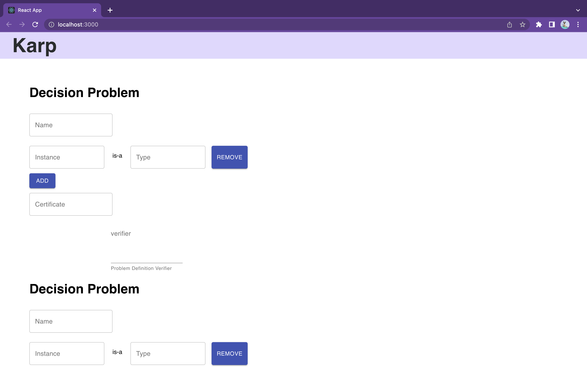
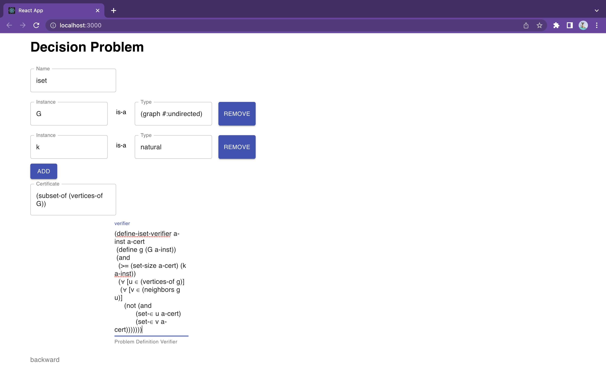
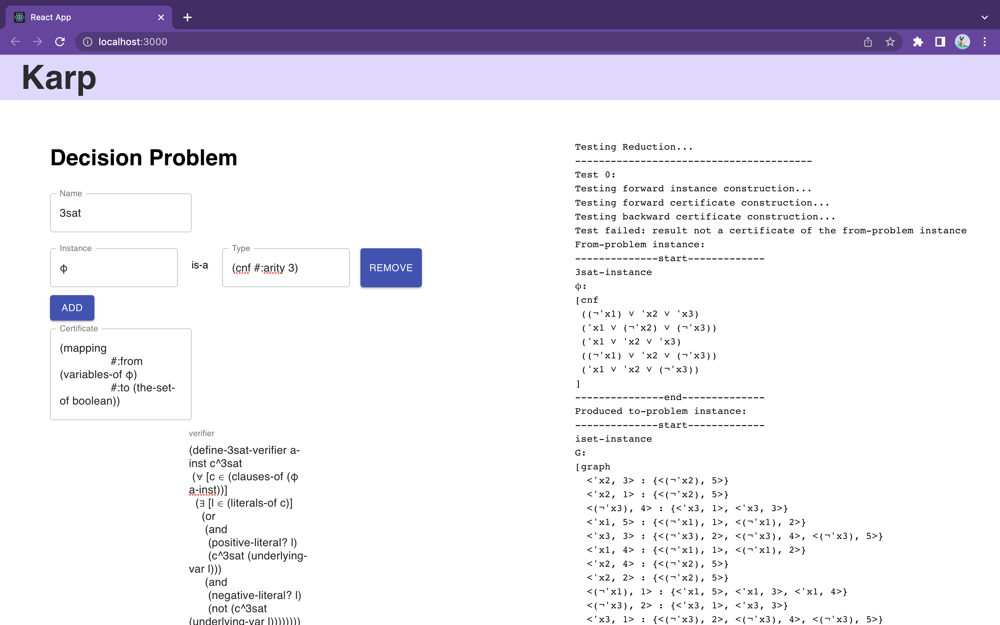

# PROJECT STATUS

Development of this version of the Karp web app will slow to a halt at the conclusion of Northwestern's 2022 Spring Quarter. It will likely be maintained and/or continued by the faculty of the COMP_SCI 336 course, though in the event that other contributors take on this project, this repository may be forked for further development.

Despite the intention for Karp to be kept as proprietary software by the faculty of COMP_SCI 336, in this iteration of the Karp web app, the only way to run the primary end-to-end user interaction is to have the Karp module in the same directory as the Racket file that is produced on a back-end server\*. At this stage of the project, our team was not provided a server that stores the Karp module itself, therefore necessitating the use of a local back-end server, and storing the Karp module at the root of the repository.

Lastly, in lieu of the absence of a server that stores the Karp module, this iteration of the Karp web app must be run entirely locally. The React app should be run first\*:

```console
# .../karp
npm run start
```

Followed by the local back-end server, spun in karp/racket-server.js\*:


```console
# .../karp
node racket-server.js
```

Then, provided the user enters every part of their reduction, the Submit button at the bottom may be clicked to receive the result shortly after.\*

\* *The latest, working version of Karp is contained on the demo branch, and should be run from there.*

# Karp

## Description

Karp is a web application written in JavaScript and React used to verify reductions of NP-Problems in real-time, allowing users to enter their problem definitions, forward and backward certificates, and instances in the titular Karp language. The app interprets the Karp text as Racket code, runs it on a backend server, generates the output, and feeds this back to a console on the frontend of the app.

The primary use-case for Karp is for Northwestern University students taking COMP_SCI 336: Design and Analysis of Algorithms, in which assignments are given involving the need to produce a reduction between two given problem definitions that is proven to be correct. 

## Background

### Class NP

A problem is called nondeterministic polynomial (NP) if its solution can be guessed and verified in polynomial time. NP is a complexity class used to classify decision problems.

### Reductions

A reduction is any algorithm for solving one decision problem using another decision problem. An efficient reduction from decision problem A to decision problem B can be used to show that decision problem B is at least as difficult as decision problem A.

## Features

- ***Karp-to-Racket translation***: As opposed to the original Karp app –– which required users to generate Racket code from Karp, leave the web app, and manually run the produced Racket files on their local machines –– this version of the Karp web app provides a streamlined interface for problem definitions and the other parts of a reduction, allowing users to input their definitions as readable "Karp" text!
- ***Real-time output***: Upon providing every part of the reduction and clicking the "Submit" button, users are given the results of their reduction on a console built-in to the web app!
- ***Add/remove instances***: Baked into the user interface are add/remove buttons for each decision problem instance, allowing users to edit the exact number of instances their problem definitions require!

## Installation

### Requirements

In order to properly run Karp in its current state, the latest version of [Racket](https://download.racket-lang.org/) (v8.4) and Karp (v2.0) must be installed. Karp is currently maintained as propriety software by faculty of the COMP_SCI 336 course, and as such, will only be distributed to current students of the course, and to authorized contributers of this repository on an individual basis.

After installing Racket and opening DrRacket, use the package manager to install the Karp package.


## Usage

Looking at the working Karp app on the DEMO branch, a user begins at the home page for Karp:



In order to receive the verification output of the reduction from one problem to another, the user must input all of the following into each corresponding text field: the problem definition that is being reduced from (Reduced-From), the problem definition that is being reduced to (Reduced-To), the forward reduction definition (Forward), the backward reduction definition (Backward), and the reduction instance definition (Instance). The example used in the following screenshot is the reduction from the 3SAT problem (the satisfiability problem, where each clause is restricted to 3 literals) to the ISET problem (the independent decision set problem):


For some problem definitions –– such as ISET –– there may be a need to include more than one instance, in which case the add/remove buttons can be used to edit the precise number of instances needed:



After everything is entered in, and the user waits a few moments after pressing the "Submit" button at the bottom, the Karp console will display the output of the Karp input interpreted and run as Racket:



## Contributing
Pull requests are welcome. For major changes, please open an issue first to discuss what you would like to change.

Please make sure to update tests as appropriate.

## Authors and Acknowledgment

Thank you to Jaz, Roy, Grace L, Arhan, Brando, Bobo and Grace W for coming together to make this project happen, and a special thanks goes to Christos and Chenhao for working alongside all of us contributers as project clients to better realize the Karp web app.

## License

N/A

# Create React App Toolchain <br>("Getting Started with Create React App")</br>

This project was bootstrapped with [Create React App](https://github.com/facebook/create-react-app).

## Available Scripts

In the project directory, you can run:

### `npm start`

Runs the app in the development mode.\
Open [http://localhost:3000](http://localhost:3000) to view it in your browser.

The page will reload when you make changes.\
You may also see any lint errors in the console.

### `npm test`

Launches the test runner in the interactive watch mode.\
See the section about [running tests](https://facebook.github.io/create-react-app/docs/running-tests) for more information.

### `npm run build`

Builds the app for production to the `build` folder.\
It correctly bundles React in production mode and optimizes the build for the best performance.

The build is minified and the filenames include the hashes.\
Your app is ready to be deployed!

See the section about [deployment](https://facebook.github.io/create-react-app/docs/deployment) for more information.

### `npm run eject`

**Note: this is a one-way operation. Once you `eject`, you can't go back!**

If you aren't satisfied with the build tool and configuration choices, you can `eject` at any time. This command will remove the single build dependency from your project.

Instead, it will copy all the configuration files and the transitive dependencies (webpack, Babel, ESLint, etc) right into your project so you have full control over them. All of the commands except `eject` will still work, but they will point to the copied scripts so you can tweak them. At this point you're on your own.

You don't have to ever use `eject`. The curated feature set is suitable for small and middle deployments, and you shouldn't feel obligated to use this feature. However we understand that this tool wouldn't be useful if you couldn't customize it when you are ready for it.

## Learn More

You can learn more in the [Create React App documentation](https://facebook.github.io/create-react-app/docs/getting-started).

To learn React, check out the [React documentation](https://reactjs.org/).

### Code Splitting

This section has moved here: [https://facebook.github.io/create-react-app/docs/code-splitting](https://facebook.github.io/create-react-app/docs/code-splitting)

### Analyzing the Bundle Size

This section has moved here: [https://facebook.github.io/create-react-app/docs/analyzing-the-bundle-size](https://facebook.github.io/create-react-app/docs/analyzing-the-bundle-size)

### Making a Progressive Web App

This section has moved here: [https://facebook.github.io/create-react-app/docs/making-a-progressive-web-app](https://facebook.github.io/create-react-app/docs/making-a-progressive-web-app)

### Advanced Configuration

This section has moved here: [https://facebook.github.io/create-react-app/docs/advanced-configuration](https://facebook.github.io/create-react-app/docs/advanced-configuration)

### Deployment

This section has moved here: [https://facebook.github.io/create-react-app/docs/deployment](https://facebook.github.io/create-react-app/docs/deployment)

### `npm run build` fails to minify

This section has moved here: [https://facebook.github.io/create-react-app/docs/troubleshooting#npm-run-build-fails-to-minify](https://facebook.github.io/create-react-app/docs/troubleshooting#npm-run-build-fails-to-minify)
